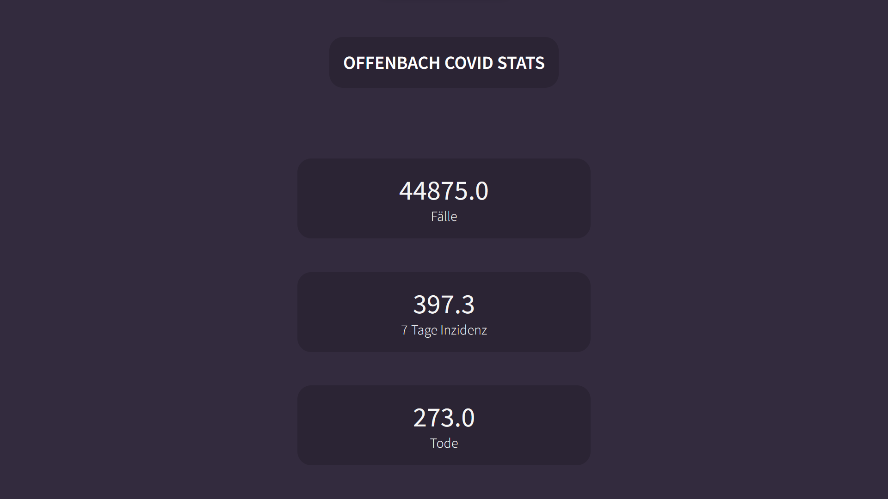

# Offenbach COVID

Simple COVID-Data App made with react.js and axios. My first ever actual finished react.js project. Made it pretty quickly.
Gets data from [this API](https://api.corona-zahlen.org/docs/).

You also can use it [here](https://marvelous-biscuit-85e9ec.netlify.app/).

